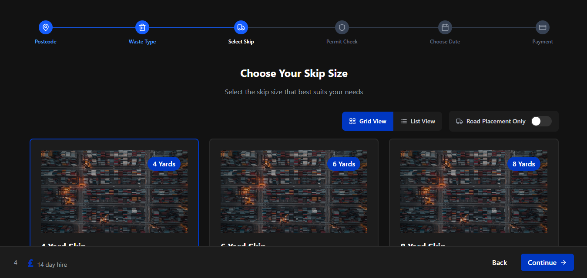

# Skip Selector - REMWaste React Coding Challenge

A modern, responsive skip selection interface for waste management applications.



## Overview

This project provides a comprehensive user interface for selecting waste management skips, with various features designed to enhance the user experience and streamline the selection process.

## Features

- **Modern UI/UX**: Clean, intuitive interface with responsive design
- **Multiple View Options**: Switch between grid and list views
- **Filtering**: Filter skips by road placement capability
- **Interactive Selection**: Clear visual indication of selected items
- **Skip Size Guide**: Informative modal with skip size information
- **Loading and Error States**: Graceful handling of data loading and errors
- **Progress Tracking**: Order stepper component to track user progress

## Project Structure

```
src/
├── components/
│   ├── ActionBar.tsx
│   ├── ErrorState.tsx
│   ├── FilterBar.tsx
│   ├── LoadingState.tsx
│   ├── OrderStepper.tsx
│   ├── SkipCard.tsx
│   ├── SkipGrid.tsx
│   ├── SkipList.tsx
│   ├── SkipSelector.tsx
│   ├── SkipSizeModal.tsx
│   ├── SkipSummary.tsx
│   └── types.ts
├── services/
│   └── skipService.ts
├── types/
│   └── skip.ts
├── App.tsx
└── main.tsx
```

## Technologies Used

- **React**: UI library
- **TypeScript**: Type safety and developer experience
- **Tailwind CSS**: Styling and responsive design
- **Framer Motion**: Animations and transitions
- **Lucide React**: Icon library

## API Integration

The application fetches skip data from:
```
https://app.wewantwaste.co.uk/api/skips/by-location?postcode=NR32&area=Lowestoft
```

## Getting Started

### Prerequisites

- Node.js (v14 or later)
- npm or yarn

### Installation

1. Clone the repository:
   ```bash
   git clone https://github.com/abdur-rakib-rony/REMWaste-React-coding-challenge.git
   ```

2. Install dependencies:
   ```bash
   npm install
   # or
   yarn
   ```

3. Start the development server:
   ```bash
   npm run dev
   # or
   yarn dev
   ```

4. Open your browser and navigate to `http://localhost:5173`

## Usage

The Skip Selector component is part of a larger order flow:

1. User selects their postcode
2. User specifies waste type
3. User selects appropriate skip size (this component)
4. Permit check for skip placement
5. User chooses delivery date
6. Payment processing

## Responsive Design

The interface is fully responsive and optimized for:
- Mobile devices
- Tablets
- Desktop computers

## License

[MIT](LICENSE)

## Acknowledgements

- Skip images and data provided by WeWantWaste.co.uk
- Icons by [Lucide](https://lucide.dev/)